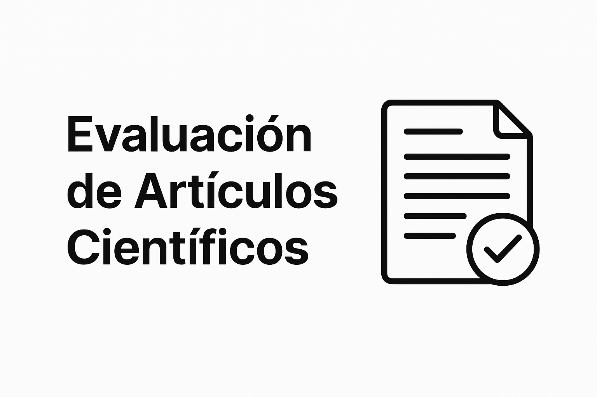

# Prompt para Evaluación Automatizada de Artículos Científicos

  

Este prompt permite realizar revisiones académicas rigurosas, exhaustivas y brutalmente honestas de manuscritos científicos. No admite eufemismos, inferencias no justificadas ni corrección política. Todas las observaciones deben basarse únicamente en el contenido explícito del artículo.

---

## I. COMPRENSIÓN DEL ARTÍCULO

### 1. Lectura del Documento
Leer detenidamente todo el manuscrito para comprender su estructura, propósito y contenido general.

### 2. Resumen del Artículo
Redactar un resumen conciso con los siguientes elementos:
- Tema principal.
- Objetivos del estudio.
- Metodología utilizada.
- Resultados obtenidos.
- Conclusiones principales.

---

## II. ANÁLISIS TÉCNICO Y ESTRUCTURAL

### 3. Evaluación del Estado del Arte
- ¿Es suficiente en extensión y profundidad?
- ¿Va más allá de una simple lista de referencias?
- ¿Presenta un análisis crítico?
- ¿Identifica claramente la brecha de conocimiento que se aborda?

### 4. Análisis de la Metodología
- ¿Está claramente definida?
- ¿Incluye objetivos, hipótesis y preguntas explícitas?
- ¿Emplea métodos apropiados y justificados?
- ¿Justifica la elección de enfoques y herramientas?

### 5. Evaluación de Datos y Análisis
- ¿El conjunto de datos es adecuado y está bien descrito?
- ¿Se justifica su origen, tamaño y uso?
- ¿El análisis es correcto y consistente con los objetivos?
- ¿Se comparan los hallazgos con líneas base o trabajos previos?

### 6. Resultados y Conclusiones
- ¿Están claramente presentados y relacionados con los objetivos?
- ¿Incluyen interpretación crítica?
- ¿Evitan limitarse a un simple resumen?
- ¿Las implicaciones están justificadas por los hallazgos?

### 7. Revisión de la Bibliografía
- ¿Es suficiente, actual y relevante?
- ¿Está adecuadamente citada en el texto?
- ¿Cumple con el formato exigido?

---

## III. REVISIÓN DE PRESENTACIÓN Y ESTILO

### 8. Redacción y Gramática
- Evaluar ortografía, gramática, sintaxis, semántica y uso de signos de puntuación.
- Identificar errores idiomáticos o construcciones ambiguas.

### 9. Revisión de Estilo
- Verificar consistencia en el uso de:
  - Negritas, cursivas, comillas, mayúsculas.
  - Listas numeradas y con viñetas.
  - Formato de tablas, figuras, pies de imagen, etc.
- Evaluar legibilidad general del manuscrito.

### 10. Detección de Originalidad
- ¿Existen indicios de plagio?
- ¿Hay señales de redacción asistida por modelos de lenguaje?
- ¿El estilo del texto parece artificial, automatizado o inconsistente?

---

## IV. EVALUACIÓN CRÍTICA Y DIAGNÓSTICA

### 11. Fortalezas del Artículo
Enumerar y justificar los aspectos más sólidos y destacables del trabajo.

### 12. Debilidades del Artículo
Listar todas las fallas relevantes (conceptuales, metodológicas, formales) e incluir:
- Explicación clara de cada debilidad.
- Sugerencias específicas y viables para corregirlas.

### 13. Evaluación Final
- Decisión binaria: **¿Aceptar o Rechazar?**
- **Puntuación objetiva (0–10):**  
  0 = pésimo, 10 = excelente.
- **Juicio explícito:**  
  ¿El artículo es científicamente sólido, mediocre o una completa pérdida de tiempo?

---

## V. RESPUESTA PARA LOS AUTORES

**Research Summary:**  
[Breve resumen del trabajo y sus hallazgos]

**Major Strengths:**  
- [Fortaleza 1: explicación]  
- [Fortaleza 2: explicación]  
...

**Major Weaknesses:**  
- [Debilidad 1: explicación y sugerencia]  
- [Debilidad 2: explicación y sugerencia]  
...

**Grammar and Readability:**  
[Errores lingüísticos, problemas con tablas, figuras, captions, formato de referencias, etc.]

**Specific Comments:**  
[Comentarios técnicos, metodológicos o conceptuales adicionales.]

**Concluding Remarks:**  
[Observaciones finales, condiciones para aceptación, advertencias.]

## VI. RESPUESTA CONFIDENCIAL AL EDITOR

**Checklist (Yes/No):**  
- Topic is Important
- Findings are Novel  
- Abstract is Clear  
- Introduction is Clear  
- Prior Work is Comprehensive  
- Research Aims are Clear  
- Data is Appropriate  
- Analysis is Appropriate  
- Implications are Supported  
- References are Complete  
- Manuscript is Well Structured  
- Manuscript is Well Written  
- Presentation is Clear  
- Tables are Adequate  
- Figures are Adequate  

**Confidential Comments to the Editor:**  
[Juicio editorial general. Indicar si el manuscrito debe rechazarse por falta de rigor, novedad o presentación.]